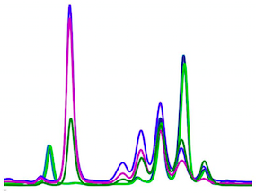
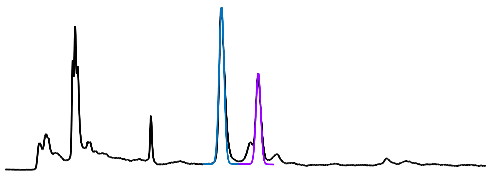
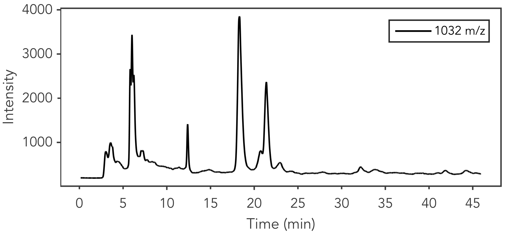

#Chromatography Toolbox

<table style="width:100%">
<tr>

<td align="center">
	Open-source code for processing chromatography data in the MATLAB programming environment
</td>

<td>
	
</td>

</tr>
</table>

##Download

Select the [`Download ZIP`](https://github.com/chemplexity/chromatography/archive/master.zip) button on this page or visit the [MATLAB File Exchange](http://www.mathworks.com/matlabcentral/fileexchange/47696-chromatography-toolbox) to download a copy of the current release.

##Features

<table style="width:100%">
<tr>

<td align="center">
	<b><a href="https://github.com/chemplexity/chromatography/wiki/Import">Import Data</a></b>
</td>

<td align="center" style="width:100%">
	<table style="width:100%">
	<tr>
		<th>Type</th>
		<th>Extension</th>
	</tr><tr></tr><tr>
		<td align="center">Agilent </td>
		<td align="center"><code>.D</code>, <code>.MS</code></td>
	</tr><tr></tr><tr>
		<td align="center">netCDF</td>
		<td align="center"><code>.CDF</code></td>
	</tr>
	</table>
</td>

</tr><tr><td colspan="2"></td></tr><tr>

<td align="center">
	<b><a href="https://github.com/chemplexity/chromatography/wiki/Baseline">Baseline Correction</a></b>
</td>

<td align="center">
	
</td>		

</tr><tr><td colspan="2"></td></tr><tr>

<td align="center">
	<b>Curve Fitting</b>
</td>

<td align="center">
	
</td>	

</tr><tr><td colspan="2"></td></tr><tr>

<td align="center">
	<b><a href="https://github.com/chemplexity/chromatography/wiki/Visualization">Visualize</a></b>
</td>

<td align="center">
	
</td>	

</tr>
</table>

##System Requirements

Current release stable on the following systems:

* OSX 10.9+, Windows 7
* MATLAB 2013b+

## Documentation
Visit the [wiki](https://github.com/chemplexity/chromatography/wiki/) for a full list of methods and options.

