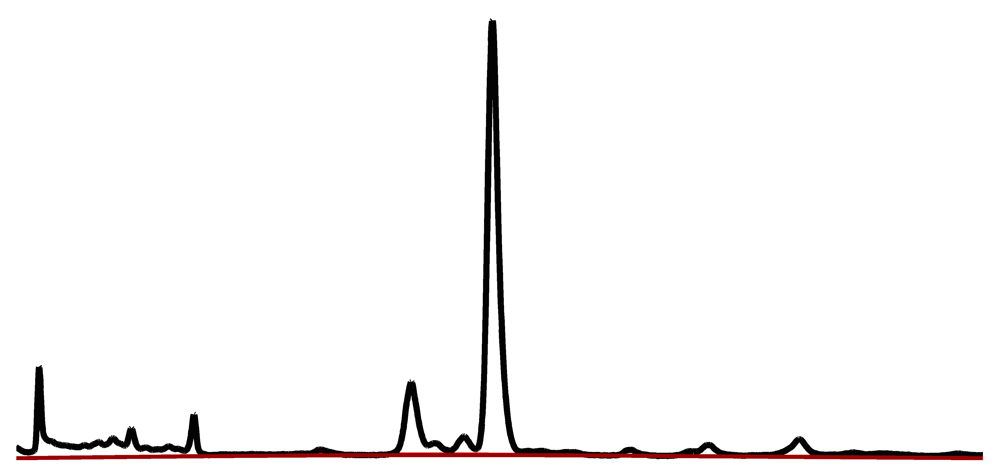
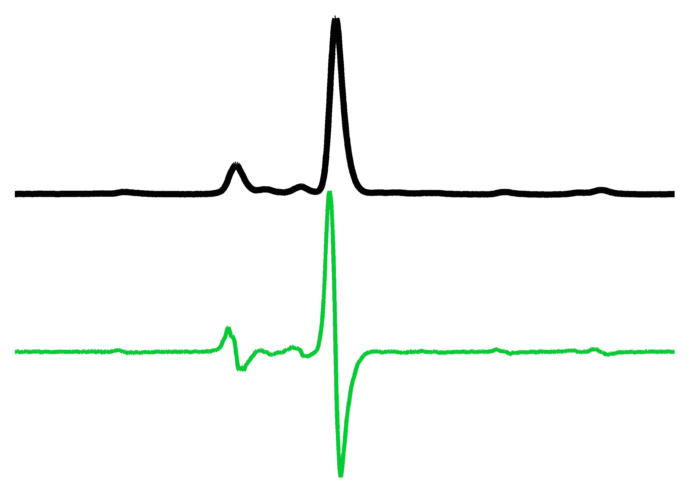
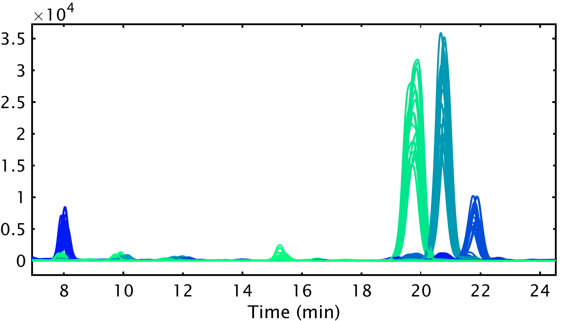

#Chromatography Toolbox

|Open-source code for processing chromatography data in the MATLAB programming environment.||
|:--|--:|

##Download

Select the [`Download ZIP`](https://github.com/chemplexity/chromatography/archive/master.zip) button on this page or visit the [MATLAB File Exchange](http://www.mathworks.com/matlabcentral/fileexchange/47696-chromatography-toolbox) to download a copy of the current release.

##Features

Check out the [in-depth guide](https://github.com/chemplexity/chromatography/wiki/) for a full overview of features.

<table style="width:100%">
<tr>
<td align="center"><b>File Conversion</b></td>
<td valign="middle"><br><ul>
<li>Agilent (.D, .MS)</li>
<li>netCDF (.CDF)</li>
</ul>
</td>
</tr>
<tr>
<td colspan="2">
</td>
</tr>
<tr>
<td align="center"><b>Baseline Correction</b></td>
<td align="center"><a href="https://raw.githubusercontent.com/chemplexity/chromatography/master/Examples/baseline.png"></a></td>		
</tr>
<tr>
<td colspan="2">
</td>
</tr>
<tr>
<td align="center"><b>Peak Detection</b></td>
<td align="center"><a href="https://raw.githubusercontent.com/chemplexity/chromatography/master/Examples/derivative.png"></a></center></td>
</tr>
<tr>
<td colspan="2">
</td>
</tr>
<tr>
<td align="center"><b>Curve Fitting</b></td>
<td align="center"><a href="https://raw.githubusercontent.com/chemplexity/chromatography/master/Examples/integration.png"></td>
</tr>
<tr>
<td colspan="2">
</td>
</tr>
<tr>
<td align="center"><b>Visualization</b></td>
<td align="center"><a href="https://raw.githubusercontent.com/chemplexity/chromatography/master/Examples/visualization.png"></td>
</tr>
</table>

####System Requirements

Current release stable on the following systems:

* OSX 10.9+, Windows 7
* MATLAB >2013b

## Usage

Try the following commands on the MATLAB command line or incorporate them into existing projects. To get started, initialize the `Chromatography` class.

````matlab
obj = Chromatography
````

####Import

Import data into the MATLAB workspace with the `import` method. 

````matlab
data = obj.import('.D')
```

####Baseline

Perform baseline correction on a dataset with the `baseline` method.

````matlab
data = obj.baseline(data)
````

####Integration

Locate peaks and determine peak area using the `integrate` method.

````matlab
data = obj.integrate(data)
````

####Visualize

Explore data and view results with the `visualize` method.

````matlab
obj.visualize(data) 
````

###Documentation

Visit the [wiki](https://github.com/chemplexity/chromatography/wiki/) for a full list of methods and options.

