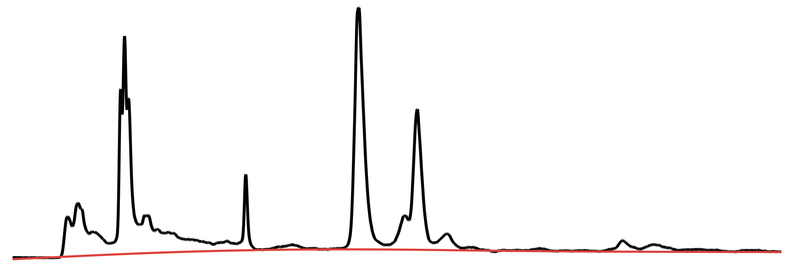

# Chromatography Toolbox

<table style="width:100%">
<tr>

<td align="center">
	Open-source code for processing chromatography and mass spectrometry data in the MATLAB programming environment
</td>

<td>
	
</td>

</tr>
</table>

## Download

Select the [`Download ZIP`](https://github.com/chemplexity/chromatography/archive/master.zip) button on this page or visit the [MATLAB File Exchange](http://www.mathworks.com/matlabcentral/fileexchange/47696-chromatography-toolbox) to download a copy of the current release.

## Features

<table style="width:100%">
	
<tr><td align="center"><b><a href="https://github.com/chemplexity/chromatography/wiki/Import">Import Data</a></b></td>

<td align="center" style="width:100%"><table style="width:100%">
	<tr>
		<th>Type</th>
		<th>Extension</th>
	</tr><tr></tr><tr>
		<td align="center">Agilent </td>
		<td align="center"><code>.D</code>, <code>.MS</code></td>
	</tr><tr></tr><tr>
		<td align="center">Thermo</td>
		<td align="center"><code>.RAW</code></td>
	</tr><tr></tr><tr>
		<td align="center">netCDF</td>
		<td align="center"><code>.CDF</code></td>
	</tr><tr></tr><tr>
		<td align="center">mzXML</td>
		<td align="center"><code>.mzXML</code></td>
	</tr>
</table></td></tr>

<tr><td colspan="2"></td></tr><tr>
<td align="center"><b><a href="https://github.com/chemplexity/chromatography/wiki/Baseline">Baseline Correction</a></b></td>
<td align="center"></td></tr>

<tr><td colspan="2"></td></tr><tr>
<td align="center"><b><a href="https://github.com/chemplexity/chromatography/wiki/Integrate">Curve Fitting</a></b></td>
<td align="center"></td></tr>

<tr><td colspan="2"></td></tr><tr>
<td align="center"><b><a href="https://github.com/chemplexity/chromatography/wiki/Visualize">Visualize</a></b></td>
<td align="center"></td></tr>

</table>

## System Requirements

Current release stable on the following systems:

* MATLAB 2013b+

## Documentation
Visit the [wiki](https://github.com/chemplexity/chromatography/wiki/) for a full list of methods and options.

## Getting Started

#### Initialize Toolbox
Add the `@Chromatography` folder to your MATLAB path and run the following code in the MATLAB command window:  

````matlab
obj = Chromatography();
````

Find out which version is currently installed using the command below:
````matlab
obj.version

ans =

    '0.1.51'
````

#### Load Data

Import raw data files into the MATLAB workspace:

````matlab
% Import Agilent '.D' files
data = obj.import('.D');

% Append data with Thermo '.RAW' files
data = obj.import('.RAW', 'append', data);
````

#### Baseline Correction

Calculate baselines for the total ion chromatograms (TIC) in all samples:

````matlab
data = obj.baseline(data,...
    'samples',    'all',...
    'ions',       'tic',...
    'smoothness', 1E7,...
    'asymmetry',  5E-6);
````

#### Smoothing

Apply a smoothing filter to the total ion chromatograms (TIC) in all samples:

````matlab
% Small amount of smoothing
data = obj.smooth(data,...
    'samples',    'all',...
    'ions',       'tic',...
    'smoothness', 10,...
    'asymmetry',  0.5);

% Heavy amount of smoothing
data = obj.smooth(data,...
    'samples',    'all',...
    'ions',       'tic',...
    'smoothness', 1000,...
    'asymmetry',  0.5);
````

#### Reset Data

Reset data to its original state with the command:

````matlab
data = obj.reset(data);
````

#### Plotting

Plot all total ion chromatograms (TIC) in a stacked layout:

````matlab
fig = obj.visualize(data,...
    'samples',  'all',...
    'ions',     'tic',...
    'layout',   'stacked',...
    'scale',    'normalized',...
    'xlim',     [5,45],...
    'colormap', 'jet',...
    'legend',   'on');
````

Plot the total ion chromatogram (TIC) for a single sample and save as a JPG (400 DPI):

````matlab
fig = obj.visualize(data,...
    'samples', 4,...
    'ions',    'tic',...
    'xlim',    [2,50],...
    'color',   'black',...
    'legend',  'on',...
    'export',  {'MyFileName', '-djpeg', '-r400'});
````

Plot selected extracted ion chromatograms (XIC) for selected samples and save as a PNG (150 DPI):

````matlab
fig = obj.visualize(data,...
    'samples',  [1:2,6,9:10],...
    'ions',     [10:50,55,59,100:200],...
    'layout',   'stacked',...
    'scale',    'full',...
    'xlim',     [10,30],...
    'colormap', 'winter',...
    'legend',   'on',...
    'export',   {'MyFileName', '-dpng', '-r150'});
````
